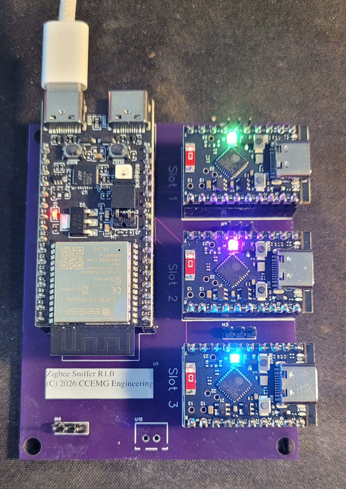
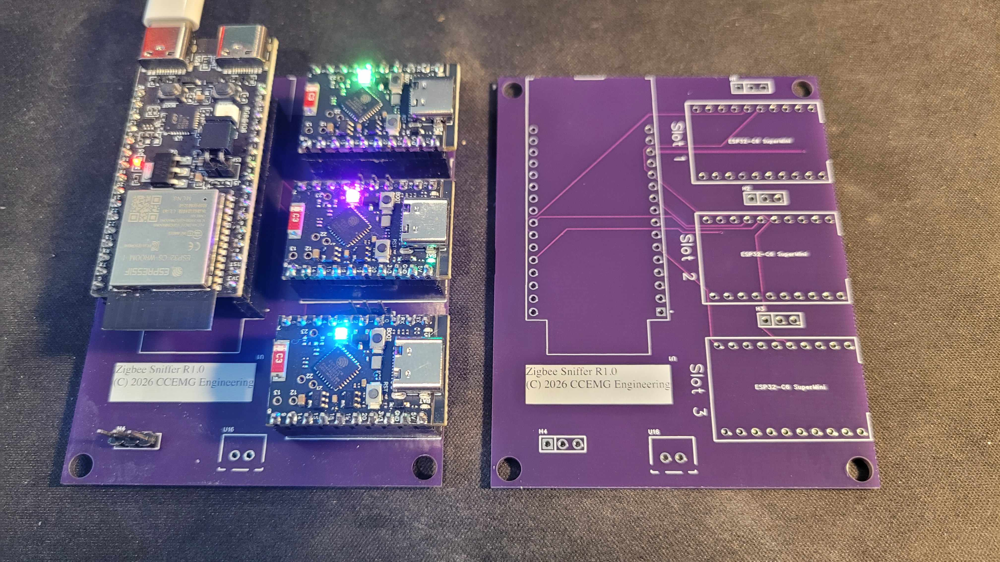

# The Board Comes Home

There's a specific kind of nervousness that a schematic review can't fully cure. You can catch a
mislabeled part number, a missing control line, two satellites wired to each other instead of back
to the primary, a satellite with no path to power — all of that got found and fixed pin-by-pin
against the firmware's actual GPIO definitions before this board ever went to a fab (the full
story is in [project-story.md](project-story.md#from-schematic-to-silicon-verifying-the-carrier-board)).
None of that tells you whether the *physical* board will do what the verified one on paper says it
will. Today it came back from the fab, and it does.

Purple soldermask, "Zigbee Sniffer R1.0 (C) 2026 CCEMG Engineering" silkscreened right onto the
board — CCEMG Engineering being the actual contract-engineering work I do when I'm not chasing
Zigbee dropouts, so the silkscreen isn't a joke, just a company mark showing up on a personal
project for once instead of a client's. Primary on the left with its two USB-C ports, three ESP32-C6 SuperMinis
socketed into Slot 1, Slot 2, and Slot 3 on the right, each one lighting its own status LED a
different color the instant power came up — green, magenta, blue — with no reflow rework, no bodge
wires, no "well it mostly works." Power came up clean, all three satellites enumerated, and frames
started flowing on the very first try.

The second shot is the one that actually matters more than the pretty one: a bare, unpopulated
board sitting next to the populated one, silkscreen outlines for all three `ESP32-C6 SuperMini`
footprints, header pads, and the shared SPI/SYNC bus traces visible and exactly where the netlist
said they'd be. That's the payoff for every one of those schematic-review catches — the board
that came back isn't just *a* board, it's *the* board that was checked.

## The one thing that wasn't quite right

Bring-up did turn up one real surprise: satellite **slot 1** and **slot 2** had their CS/DATA_READY
selector lines physically reversed relative to the verified design — the socket silkscreened
"Slot 1" was actually wired to what firmware expected to be slot 2's lines, and vice versa. Slot 3
was untouched. Everything still worked; it just meant the board's own labels and the firmware's
`radio_id` assignment disagreed about which physical socket was which.

There were two ways to handle that: respin the board, or make the firmware agree with the board
that's actually sitting on the desk. A respin for a two-pin swap felt like the wrong instinct —
so firmware and docs now treat the as-built wiring as correct going forward. `radio_id` 1 and 2 map
to the physically-reversed lines on purpose, the pinout table and netlist reference note the swap
explicitly, and nobody has to remember it's "backwards" because as of now it isn't. One reversed
pair out of every net on the board, caught in the first ten minutes of bring-up instead of after
weeks of confusing debug sessions — that's a good trade for a two-line firmware change.

## What's left

Everything else — shared SCK/MOSI/MISO, the SYNC fan-out, per-satellite power — behaved exactly
like the schematic said it would, which after months of reviewing a design only on paper is a
genuinely satisfying thing to type. The remaining work is no longer electrical: design an
enclosure for the populated board and send it to the 3D printer. That's the last step between "a
board on a desk" and something you'd actually leave running in a closet.
