# User Guide

The complete guide to the **Zigbee Sniffer & Diagnostics** web interface. New here? Start with the
**[Quickstart](quickstart.md)**, then come back for the details.

**Contents**
- [What it is](#what-it-is)
- [The interface at a glance](#the-interface-at-a-glance)
- [The top bar](#the-top-bar)
- [Overview tab](#overview-tab)
- [Live frames tab](#live-frames-tab)
- [RF spectrum tab](#rf-spectrum-tab)
- [Active testing tab](#active-testing-tab)
- [Diagnostics tab](#diagnostics-tab)
- [Config tab](#config-tab)
- [About tab](#about-tab)
- [Key concept: sniffer vs network signal](#key-concept-sniffer-vs-network-signal)
- [Key concept: radio roles & allocation](#key-concept-radio-roles--allocation)
- [Workflow: diagnosing dropouts](#workflow-diagnosing-dropouts)
- [Firmware updates (OTA)](#firmware-updates-ota)
- [Configuration & security](#configuration--security)
- [Troubleshooting](#troubleshooting)
- [Command-line reference](#command-line-reference)

---

## What it is

A full 802.15.4 sniffer and diagnostics platform: an **ESP32-C6** captures the air, a single-binary
**Go host** (`zbsniff`) decodes/decrypts/stores it and serves a web dashboard. Built to hunt down
the classic problem — *devices that go unresponsive until you power-cycle them.*

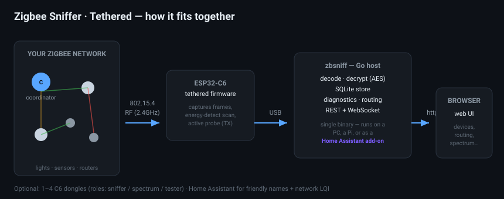

It runs anywhere the binary runs — a laptop, a Raspberry Pi, or **inside Home Assistant as an
add-on** (see [deployment-addon.md](deployment-addon.md)).

---

## The interface at a glance

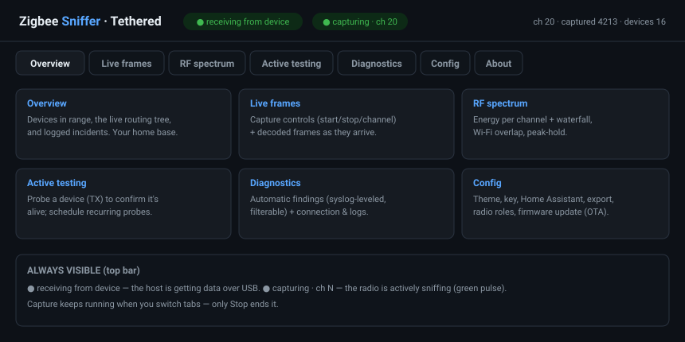

The app is organised into tabs. Capture runs on the **device**, so it keeps going when you switch
tabs — only **Stop** ends it.

---

## The top bar

Always visible, on every tab:

| Indicator | Meaning |
|-----------|---------|
| **● receiving from device** (green) | the host is getting data over USB. Grey/"host up — no device data" means the serial link is down — see [Troubleshooting](#troubleshooting). |
| **● capturing · ch N** (green, pulsing) | the radio is actively sniffing. Amber "capture mode · no new frames" = quiet or stalled; "◐ ED sweep" = spectrum scanning; "■ idle/stopped". |
| **ch · captured · dropped · devices** | live counters. `captured` should climb steadily on an active network. |
| **decrypting** | the network key is loaded and payloads are being decoded. |

---

## Overview tab

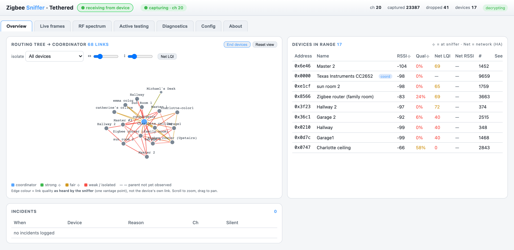

Your home base — three panels:

**Devices in range.** Every device the sniffer has heard, with:
- **RSSI ⌖ / Qual ⌖** — signal *as heard by the sniffer* (the ⌖ marks "at the sniffer").
- **Net LQI / Net RSSI** — the coordinator's own view (needs Home Assistant; often only LQI is
  reported). See [sniffer vs network](#key-concept-sniffer-vs-network-signal).
- **#** frames seen and **Seen** (age). Click a row to open the **detail drawer** — signal, recent
  messages, and a **Probe now** button.

**Routing tree.** A live, physics-based map of how devices reach the coordinator.

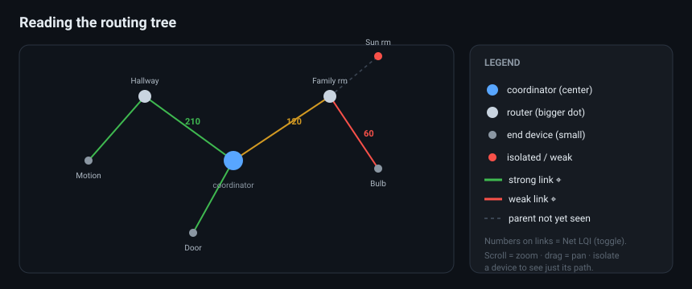

- **Scroll to zoom, drag to pan.** Labels stay readable as you zoom.
- **↔ / ↕ sliders** spread the layout so names don't overlap.
- **Isolate** a device to show only its path back to the coordinator.
- **Net LQI** toggle prints the network LQI on each link.
- **End devices** toggle shows/hides leaf nodes (routing backbone only).
- **Foreign** toggle shows/hides devices on *other* networks (e.g. Philips Hue). Foreign nodes are
  **purple** and labelled `…/FGN:<channel>`. They appear once you've heard that network — pin your
  channel there or use the **Monitor** button on the Zigbee-networks panel; their names (from a
  paired Hue bridge) and manufacturer are saved and survive restarts.
- Edge colour = link quality **as heard by the sniffer**; a **dashed** line means we haven't yet
  observed that device's parent.

**Device details** (click a device). Beyond signal/messages, the drawer shows **Capabilities**
(endpoints + in/out clusters, manufacturer, model, power — pulled from the coordinator/ZHA, no
on-air interrogation; **Re-interview** re-pulls it on demand) and a **Path from coordinator**
button that plots the route to the device hop-by-hop with per-hop LQI (from ZHA's neighbour table,
or the sniffer's observed links). An **Active interrogation** section can **transmit** an encrypted
ZDO request (read bindings / query endpoints) directly to the device — gated behind a confirmation,
and needs firmware ≥ 0.28; the reply shows up in the device's Recent messages.

A **⚠ channel-hopping** badge appears in the top bar whenever the radio is hopping (which only
captures your network part of the time) — click it to pin back to your channel.

**Incidents.** Timestamped dropout events the host flags automatically: a device that was
heard regularly then **went silent** past the threshold (with the channel's energy at that
moment), and a **recovered** entry when it returns. Tune the silence threshold in **Config →
Incident detection** (default 120 s). This is the log that catches devices dropping off.

---

## Live frames tab

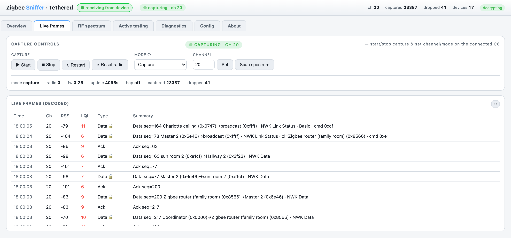

**Capture controls** (top): Start / Stop / Restart / **Reset radio**, the **Mode** selector, the
**Channel** + **Scan spectrum**. Below, **Live frames** shows decoded frames as they arrive,
newest-first, with **friendly names in parentheses** (e.g. `Charlotte ceiling (0xcf67)`).

- **Click any frame** to open the **inspector**: a layer-by-layer decode (MAC / NWK / APS / ZCL),
  the resolved device name and IEEE address, and a raw hex dump. **Copy hex** or **Export JSON**
  (the full decode + metadata) from the drawer.
- The table **seeds from history** on load, so you see recent frames even during a quiet moment.
- **Mode**: *Capture* = sniff frames; *ED spectrum sweep* = feed the spectrum tab (no capture);
  *Capture + ED* = both on one radio (time-sliced); *Idle* = park it. With multiple radios, prefer
  **[roles](#key-concept-radio-roles--allocation)** over changing mode.
- **⏸** pauses the live list (capture keeps running on the device).

---

## RF spectrum tab

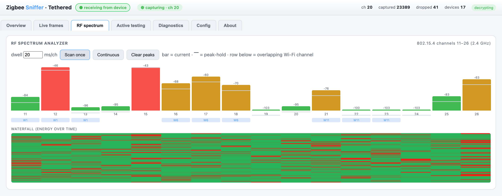

A spectrum analyzer built on the radio's energy-detect (ED):
- **Scan once** or **Continuous**; adjustable **dwell** (ms/channel); **peak-hold** markers.
- Per-channel bars + a **Wi-Fi overlap** row (which Wi-Fi channel sits on each Zigbee channel).
- A **waterfall** showing energy over time. Hatched-grey bars = "no reading" (not zero) — if you
  see those, reflash the firmware.

Use it to find a quieter Zigbee channel and to spot Wi-Fi/interference.

> On a single radio, a spectrum sweep **pauses capture** — the app asks before doing so, or blocks
> it if a radio is dedicated to sniffing. Add a second radio with the **spectrum** role to run both.

### Zigbee networks panel

Below the waterfall, the **Zigbee networks** panel lists every network (PAN id) the sniffer has
heard — tagged **yours** or **foreign** — with its channel, frame count, and last-seen. A foreign
network **on your channel** is a prime dropout suspect.

Because one radio hears only one channel, use a survey to see the rest of the band:
- **Passive survey** — hops channels 11–26 listening for networks that are actively transmitting.
- **Active scan ⚡** — also transmits a *beacon request* on each channel so even **idle** networks
  reply. Needs firmware ≥ 0.26; it TX's on-air (a standard Zigbee scan), so it's gated behind a
  confirmation, like the active device probe.

A survey briefly **pauses capture** (~30 s) on a single radio, then restores your channel. Full
detail: [networks.md](networks.md).

---

## Active testing tab

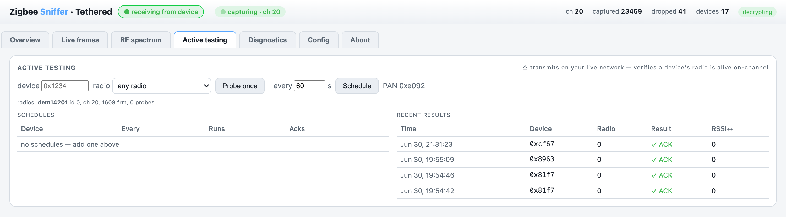

> ⚠ **Transmits on your live network.** It sends a MAC frame to a device and waits for an ACK — an
> ACK proves the device's radio is **alive and on-channel right now**. Great for confirming a
> "dropped" router.

- Enter a device **short address** (e.g. `0x1234`), pick a **radio**, hit **Probe once**.
- **Schedule** a recurring probe (every N seconds) to watch a device's responsiveness over time —
  the per-device **ACK rate** is your dropout signal.
- **Recent results** lists each probe with ACK / no-ACK and the ACK's RSSI.
- The PAN id (needed to address probes) comes from your ZHA backup.

Mainly verifies **always-on routers/repeaters**; sleepy end devices only ACK while polling.

---

## Diagnostics tab

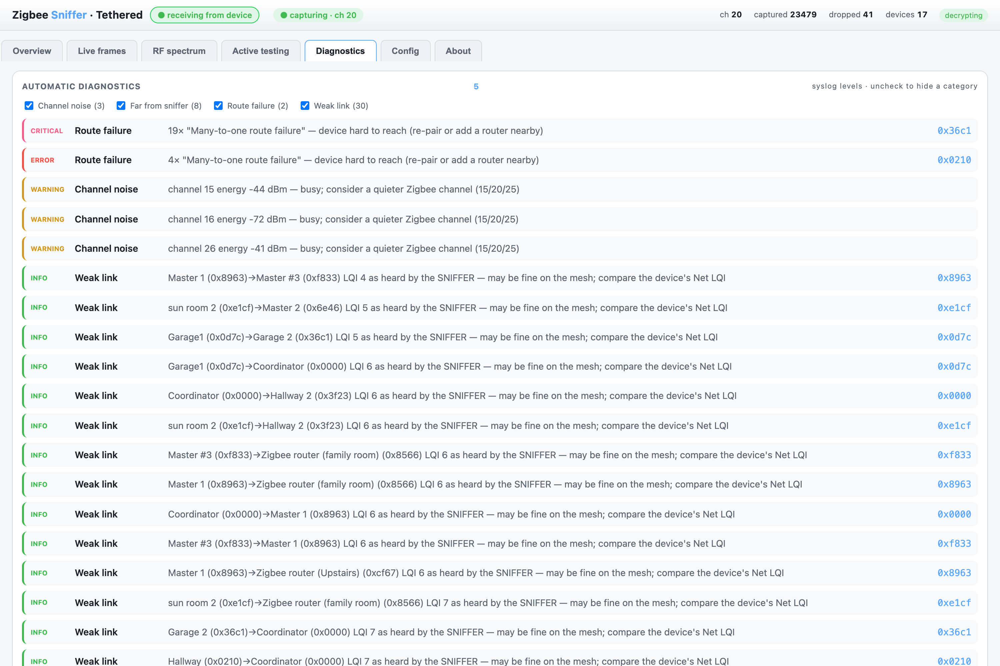

Automatic findings, using **syslog severities** (critical > error > warning > notice > info):

| Category | Level | What it means |
|----------|-------|---------------|
| **Route failure** | error/critical | a device is hard to reach — the strongest dropout signal. |
| **Silent device** | notice/warning | a once-chatty device went quiet — a dropout candidate. |
| **Coordinator** | warning | no coordinator traffic — wrong channel or stalled capture. |
| **Foreign network** | notice | another Zigbee/Thread PAN sharing your channel (interference). |
| **Channel noise** | warning | a channel is energetically busy. |
| **Weak link / Far from sniffer** | info | the **sniffer's** vantage only — *not* a mesh fault. |

**Uncheck a category** to hide it (e.g. the noisy sniffer-view "Weak link" items). Below sits
**Connection & logs** — port, bytes, frames, last-message age, and the host log, plus a
**↻ Reconnect** button to re-init the serial link.

---

## Config tab

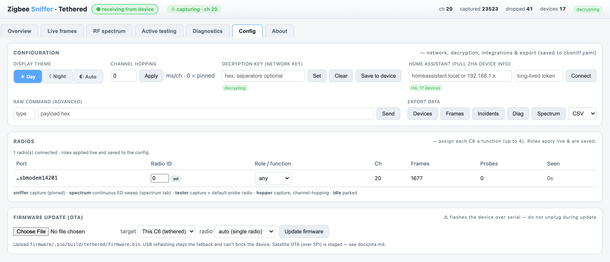

The **☀ Day · ☾ Night · ◐ Auto** toggle (top-left of Config) restyles the whole UI — same data,
either look:

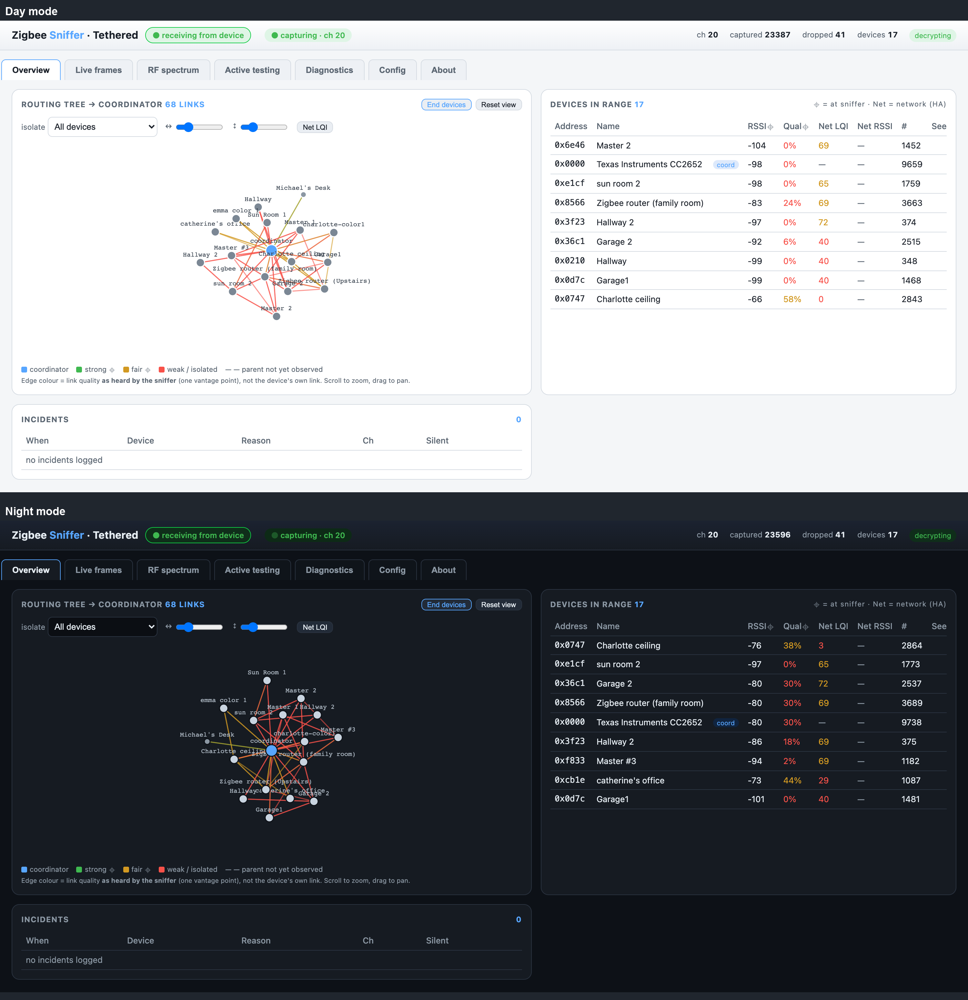

Everything that isn't live capture:
- **Display theme** — Day (light) / Night (dark) / Auto (follow the system). Remembered per browser.
- **Channel hopping** — dwell ms/channel (0 = pinned to one channel; hopping misses concurrent
  traffic, so pin for diagnostics).
- **Decryption key** — paste the Zigbee network key (hex) to decode payloads; **Save to device**
  stores it in the C6's NVS. Encrypted at rest in the config file.
- **Home Assistant** — enter just the **host or IP** + a long-lived token; the app builds the URL,
  pulls friendly names and **Net LQI**, and reconnects automatically next run.
- **Philips Hue bridge** — enter the bridge IP, press its round **link button**, then click
  **Pair**. Names Hue devices and helps identify the Hue network in *Zigbee networks*. Runs
  alongside Home Assistant (both name sources at once). The key is stored encrypted.
- **Raw command** — advanced: send an arbitrary framed command.
- **Export** — download Devices / Frames / Incidents / Diagnostics / Spectrum as CSV or JSON, or
  **Frames → pcap** for **Wireshark** (802.15.4 TAP encapsulation, with per-frame RSSI/LQI/channel).
- **Radios** — assign each connected C6 a **role** (see below), or set its radio-id.
- **Firmware update (OTA)** — see [below](#firmware-updates-ota).

---

## About tab

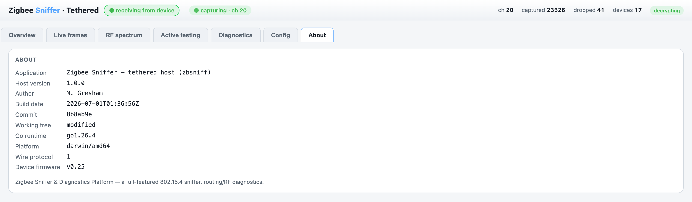

App name, **host version**, author, build date, Go/runtime info, wire-protocol version, and the
live **device firmware** version.

---

## Key concept: sniffer vs network signal

The single most important thing to understand:

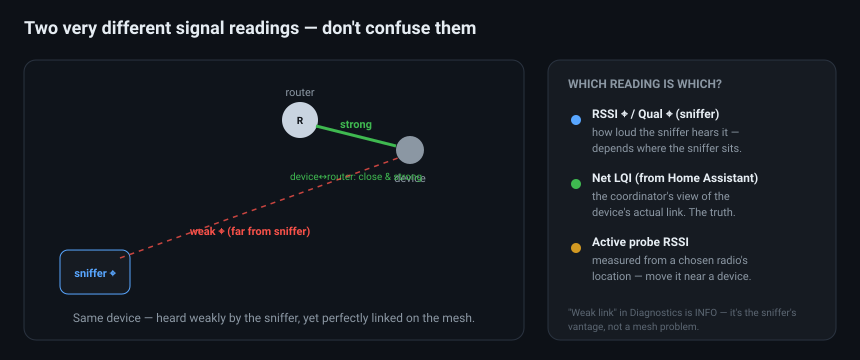

- **RSSI ⌖ / Qual ⌖** = what *your sniffer* hears from its one location.
- **Net LQI** = the *coordinator's* view of the device's real link (from Home Assistant).
- **Active-probe RSSI** = measured from a *chosen radio's* location.

A device can be **weak to the sniffer but fine on the mesh**. That's why "Weak link" is only an
**info** — to judge a device's real health, use **Net LQI** or an **active probe** from nearby.

---

## Key concept: radio roles & allocation

With up to **4 C6 dongles** plugged in, give each a **role** in **Config → Radios**:

| Role | What it does |
|------|--------------|
| **any** *(default)* | the system tasks it to any function on demand |
| **sniffer** | passive capture, pinned to the channel |
| **spectrum** | continuous ED sweep — feeds the spectrum tab without pausing capture |
| **tester** | capture + the default radio for active probes |
| **hopper** | capture with channel-hopping |
| **idle** | parked |

When you request a function (capture / spectrum / probe), the host **allocates** a radio — a
dedicated one first, else a free **any** radio. If the only radio is busy it asks to confirm; if
nothing is free it tells you exactly what each radio is doing. So one radio time-shares with
warnings; two-plus radios run everything at once with no prompts.

---

## Workflow: diagnosing dropouts

The reason this tool exists. When a device keeps going unresponsive:

1. **Pin the channel** to your network's (auto from the ZHA backup). Don't hop.
2. Leave it **capturing** for a while. Check the **Diagnostics** tab:
   - **Route failure** on the device → it's genuinely hard to reach; add/relocate a router.
   - **Silent device** → it stopped talking; note *when* relative to the dropout.
3. **Connect Home Assistant** and compare **Net LQI** to the sniffer's RSSI ⌖. If Net LQI is fine,
   the mesh link is healthy — look at the device/power, not RF.
4. **Schedule an active probe** on the suspect device (e.g. every 30 s). Watch the **ACK rate**:
   - ACKs keep coming through a "dropout" → the radio's fine; the problem is higher up (app/stack).
   - ACKs stop exactly at the dropout → the device's radio/power is the culprit; power-cycle test.
5. Check **RF spectrum** for interference (busy channel, Wi-Fi overlap, a **Foreign network**). If
   the channel is noisy, move your Zigbee network to a quieter one (15 / 20 / 25 are common).

---

## Firmware updates (OTA)

Update the C6 over USB serial — no esptool needed. **Config → Firmware update**:
1. Build the image: `cd firmware && pio run -e tethered` → `firmware/.pio/build/tethered/firmware.bin`.
2. Choose the file, the **target** (This C6, or a Satellite), and the radio; click **Update**.
3. A progress bar tracks *receiving → writing → verifying → complete (rebooting)*.

The device writes its inactive OTA slot, verifies, and reboots into it; the bootloader rolls back if
an image is bad, and **USB reflashing is always the fallback**. The very first flash (step 1 of the
quickstart) must be over USB because it installs the OTA partition table. Satellite OTA (over SPI) is
implemented but needs carrier hardware — see [ota.md](ota.md).

---

## Configuration & security

- **Everything you set in the UI persists to `zbsniff.yaml`** (override with `--config`) and reloads
  next run: channel, network key, HA host/token, radio roles, **channel-hopping dwell**, **capture
  mode**, and the **web-UI preferences** — theme, routing-tree X/Y spacing, End-devices and Net-LQI
  toggles, spectrum dwell, diagnostics category filters, and export format (stored as `ui.*` lines).
  An explicit CLI flag wins over the file; the startup log prints its absolute path.
- **Secrets are encrypted at rest.** The network key and HA token are stored as `enc:…`
  (AES-256-GCM); the key lives in a sidecar `zbsniff.yaml.key` (mode `0600`, gitignored). Copying or
  committing the YAML alone never leaks the secrets.
- Only the **network key** is needed for decryption — the other keys in a ZHA backup are APS link
  keys and aren't required.

---

## Troubleshooting

| Symptom | Fix |
|---------|-----|
| **host up — no device data** | Diagnostics → Connection & logs. 0 bytes = wrong USB port / port held by another instance (↻ Reconnect); bytes but 0 frames = reflash. |
| **captured stuck at ~20** | Old firmware RX-buffer stall — reflash the latest. |
| **no new frames after a spectrum scan** | Old firmware left the radio off-channel — reflash (fixed: the sweep restores the channel). |
| **spectrum shows −128 / hatched grey** | Reflash — the ED units fix is required. |
| **probe does nothing** | Enter a real device address; reflash (probe now wakes the radio even if capture is stopped). |
| **link keeps dropping / device re-enumerates** | The host auto-reconnects; use ↻ Reconnect to force it. |
| **wrong chip** | You need an ESP32-**C6**, not a C61 (no 802.15.4 radio). |

---

## Command-line reference

```
zbsniff [flags]
  --port <dev>        serial port (repeatable; omit to auto-detect the C6)
  --channel <11-26>   capture channel to set on start (0 = from backup/leave as-is)
  --key <hex>         Zigbee network key for decryption (separators optional)
  --zha-backup <f>    ZHA backup JSON → channel, PAN, key, and device names
  --ha-host <host>    Home Assistant host/IP (URL built automatically)
  --ha-token <tok>    HA long-lived access token
  --db <path>         SQLite path (default zbsniff.sqlite)
  --http-port <n>     web UI port (default 8080)
  --config <path>     settings file (default zbsniff.yaml; secrets encrypted)
  --baud <n>          serial baud (default 921600; USB-CDC ignores it)
```

See also: [Quickstart](quickstart.md) · [HA add-on](deployment-addon.md) · [OTA](ota.md) ·
[protocol/framing.md](../protocol/framing.md).
